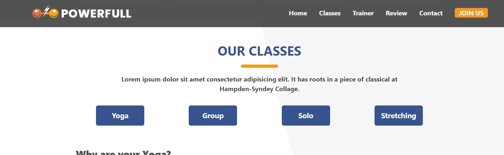
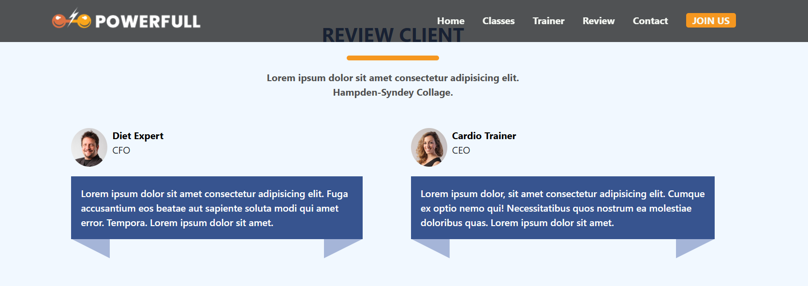
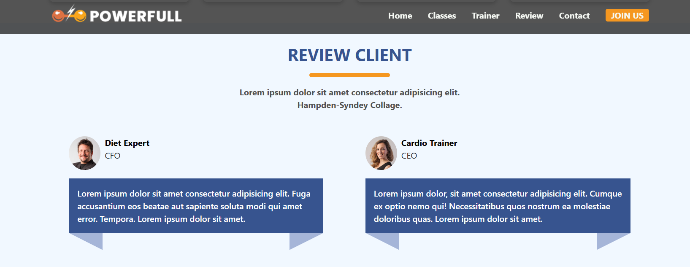
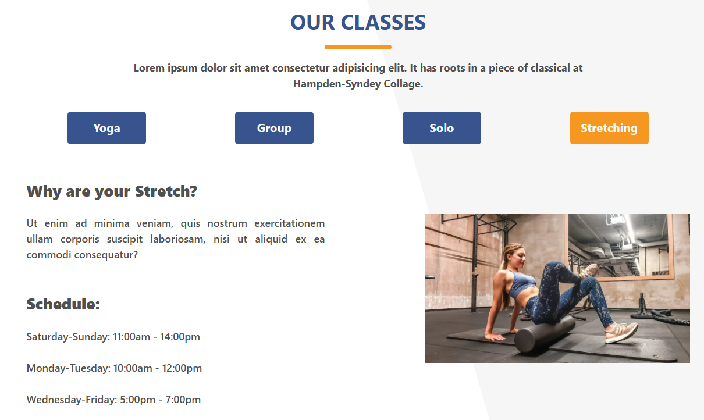

# 🏋🏽 Sport Center Projesi | Final Project #1

- Bu proje, Patika Frontend Bootcamp'i için oluşturulan **Hafta-8 / Final Projesi #1 / Sport Center** projesidir.
- **HTML, CSS, JavaScript** alıştırması için bir pratik projesidir.

---

## :computer: Kullanım

1. Hafta-8-Sport Center repomu klonlayın

- git clone https://github.com/tunahanyasar/Hafta-8-Sport-Center.git

2. Dosyayı çalıştırın.
3. Projenin Live Link'i [https://warm-pixie-710995.netlify.app/ ]

---

## 📜 Sayfa Yapısı

:open_file_folder: **Klasörler;**

- _index.html_
- _style.css_
- _script.js_
- _img_
- _img-page_

1. **_index.html_**: Websitesi açıldığında Anasayfa karşılamaktadır. **one-page website** olarak tasarlanmıştır.
   1. Anasayfada **header** ve **header**in içinde **nav** bulunur. **nav** ile Home, Classes, Trainers, Review, Contact alanlarına sayfa içinde yönlendirmeler yapılabilir.
   2. İçerik 6 **Section**dan oluşmakta;
      1. İlk ve ikinci **Section** kısmında **Hero** ve **Sayısal Detaylar** bulunur.
      2. Üçüncü **Section** kısmı **Our Classes**, 4 farklı sınıf ve ayrı ayrı butonlarla listelenmesi.
      3. Dördüncü **Section** kısmında **BMI Calculator** bulunur.
      4. Beşinci **Section** kısmı **Our Best Trainers**, eğitmenlerin bilgileri card halinde oluşturulmuştur.
      5. Altıncı **Section** kısmı **Purchase From us**, ekimplanlar card halinde listelenmiştir.
      6. Yedinci **Section** kısmı **Review Client**, müşterilerin yorumları bulunuyor.
      7. Sekizinci **Section** kısmı **Contact Us**, iletişim formu ve konum bilgisi.
   3. **Footer**
2. **_style.css:_** index.html için yazılan CSS özellikleri bu dosyada derlenmiştir.
2. **script.js:** index.html deki tüm dinamik özellikler JavaScript ile kodlanarak burada derlendi.
3. **_img:_** Projede kullanılan görsellerin klasörü.
4. **_img-page:_** Projenin sayfa çıktıları ve ödev dosyaları.

---

## :star2: Özellikler

**1.** Sayfada gezinme durumuna göre stil özellikleri alan **Header** yapısı, JavaScript ile sağlandı:
_Normal Header_

_Styled Header_

**2.** Header yüksekliği ve tıklanılan linkin div alanı JavaScript hesaplanarak içeriklerin iç içe karışmaması sağlandı.
_Before JavaScript_

_After JavaScript_

**3.** Tıklanılan butona göre ilgili kursların görselinin ve içeriğinin HTML içerisine eklenmesi:
_Görsel #1_

_Görsel #2_

**4.** Input kısmına girilen boy ve kilo değerleri JavaScript ile hesaplandıktan sonra "Turuncu Üçgenin" görsel özerinde gerekli konuma hizalanması:

**5.** CSS, clip-path - polygon ve hover ile eğitmenlerin üzerine gelindiğinde animasyon oluşması: 

---

## 💡 Kullanılan Yapılar | Kazanımlar

**HTML:**
* Semantic Tags
* Iframe
* Form Elements

**CSS:**
* Pseude Classes
* Clip-path
* Media Query
* Display - Grid & Flex

    * Google Fonts 
    * Font Awesome 

**Javascript:**
* DOM Manipulation
* Functions
* Objects
* Events
* If - Else

---

## :paperclip: Sayfa Çıktıları

### Web Sitesi

### Web Sitesi-2

