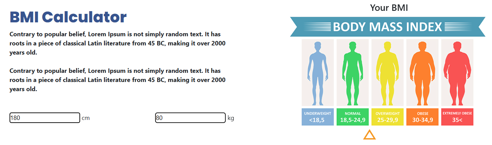

# 🏋🏽 Sport Center | Final Project #1

[🇹🇷 Click for Turkish README](./README.tr.md)

*Created on: March 23, 2025*

* This project was created as **Week-8 / Final Project #1 / Sport Center** for the Patika Frontend Bootcamp.
* Developed as a practice project for **HTML, CSS, and JavaScript**.
* Features a modern, responsive design with interactive elements.

---

## 🌐 Live Demo

Visit the live site: [Sport Center](https://warm-pixie-710995.netlify.app/)

---

## :computer: Installation and Usage

1. Clone the project:
```bash
git clone https://github.com/tunahanyasar/Hafta-8-Sport-Center.git
```
2. Navigate to the project directory:
```bash
cd Hafta-8-Sport-Center
```
3. Open `index.html` in a web browser.

---

## 📜 Project Structure

:open_file_folder: **Folders;**
* `index.html` - Main page
* `style.css` - Custom styles
* `script.js` - JavaScript functionality
* `img/` - Project images
* `img-page/` - Screenshots and documentation

### Main Features
- One-page website design
- Responsive layout
- Interactive navigation
- Dynamic content loading
- BMI calculator
- Trainer profiles
- Client reviews
- Contact form

---

## :star2: Key Features

- **Dynamic Header**
  - Style changes on scroll
  - Smooth navigation
  - Responsive design
  

- **Interactive Classes Section**
  - Dynamic content loading
  - Custom animations
  - Responsive cards
  

- **BMI Calculator**
  - Real-time calculations
  - Visual feedback
  - Interactive UI
  

- **Trainer Profiles**
  - Hover animations
  - Clip-path effects
  - Responsive cards
  

---

## 💡 Technologies Used

**Frontend:**
* HTML5 (Semantic Tags)
* CSS3 (Flexbox, Grid, Media Queries)
* JavaScript (ES6+)
* Google Fonts
* Font Awesome

**Features:**
* DOM Manipulation
* Event Handling
* Dynamic Content Loading
* Form Validation
* Responsive Design

---

## 🎯 Project Goals

1. **User Experience**
   - Smooth navigation
   - Interactive elements
   - Responsive design
   - Clear information hierarchy

2. **Technical Achievements**
   - Vanilla JavaScript implementation
   - CSS animations and transitions
   - Responsive layout techniques
   - Dynamic content management

---

## 📸 Screenshots

### Full Page View


### Mobile View


---

## 📞 Contact

[Tunahan Yaşar](https://github.com/tunahanyasar)

* GitHub: [@tunahanyasar](https://github.com/tunahanyasar)
* LinkedIn: [Tunahan Yaşar](https://www.linkedin.com/in/tunahan-yasar/)
