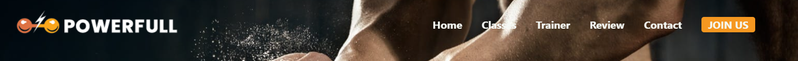
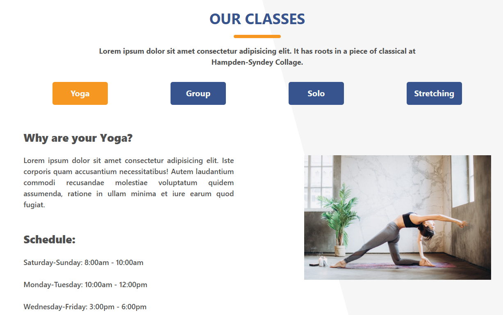
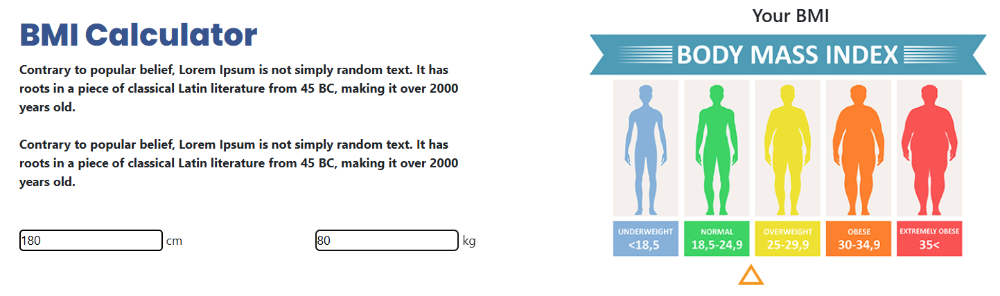
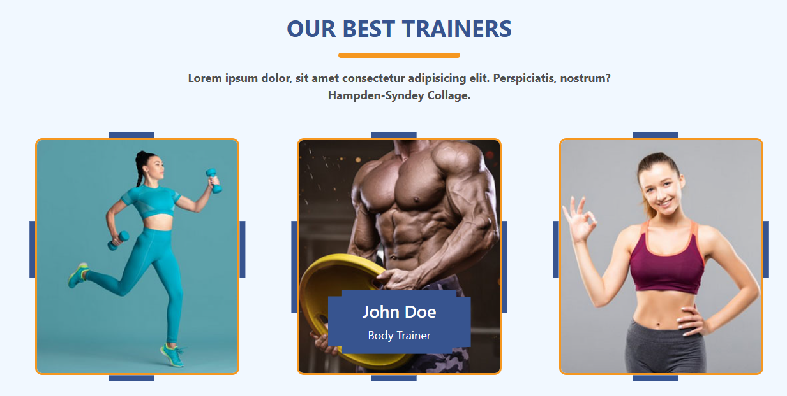

# 🏋🏽 Sport Center | Final Project #1

[🇬🇧 Click for English README](./README.md)

*Oluşturulma Tarihi: 23 Mart 2025*

* Bu proje, Patika Frontend Bootcamp'i için oluşturulan **Hafta-8 / Final Projesi #1 / Sport Center** projesidir.
* **HTML, CSS ve JavaScript** pratiği için geliştirilmiştir.
* Modern, responsive tasarım ve interaktif elementler içerir.

---

## 🌐 Canlı Demo

Canlı siteyi ziyaret edin: [Sport Center](https://warm-pixie-710995.netlify.app/)

---

## :computer: Kurulum ve Kullanım

1. Projeyi klonlayın:
```bash
git clone https://github.com/tunahanyasar/Hafta-8-Sport-Center.git
```
2. Proje dizinine gidin:
```bash
cd Hafta-8-Sport-Center
```
3. `index.html` dosyasını bir web tarayıcısında açın.

---

## 📜 Proje Yapısı

:open_file_folder: **Klasörler;**
* `index.html` - Ana sayfa
* `style.css` - Özel stiller
* `script.js` - JavaScript fonksiyonları
* `img/` - Proje görselleri
* `img-page/` - Ekran görüntüleri ve dokümantasyon

### Ana Özellikler
- Tek sayfa web sitesi tasarımı
- Responsive düzen
- İnteraktif navigasyon
- Dinamik içerik yükleme
- BMI hesaplayıcı
- Eğitmen profilleri
- Müşteri yorumları
- İletişim formu

---

## :star2: Öne Çıkan Özellikler

- **Dinamik Header**
  - Scroll durumuna göre stil değişimi
  - Akıcı navigasyon
  - Responsive tasarım
  

- **İnteraktif Kurslar Bölümü**
  - Dinamik içerik yükleme
  - Özel animasyonlar
  - Responsive kartlar
  

- **BMI Hesaplayıcı**
  - Gerçek zamanlı hesaplamalar
  - Görsel geri bildirim
  - İnteraktif arayüz
  

- **Eğitmen Profilleri**
  - Hover animasyonları
  - Clip-path efektleri
  - Responsive kartlar
  

---

## 💡 Kullanılan Teknolojiler

**Frontend:**
* HTML5 (Semantic Tags)
* CSS3 (Flexbox, Grid, Media Queries)
* JavaScript (ES6+)
* Google Fonts
* Font Awesome

**Özellikler:**
* DOM Manipülasyonu
* Event Yönetimi
* Dinamik İçerik Yükleme
* Form Doğrulama
* Responsive Tasarım

---

## 🎯 Proje Hedefleri

1. **Kullanıcı Deneyimi**
   - Akıcı navigasyon
   - İnteraktif elementler
   - Responsive tasarım
   - Net bilgi hiyerarşisi

2. **Teknik Kazanımlar**
   - Vanilla JavaScript implementasyonu
   - CSS animasyonları ve geçişleri
   - Responsive layout teknikleri
   - Dinamik içerik yönetimi

---

## 📸 Ekran Görüntüleri

### Tam Sayfa Görünümü


### Mobil Görünüm


---

## 📞 İletişim

[Tunahan Yaşar](https://github.com/tunahanyasar)

* GitHub: [@tunahanyasar](https://github.com/tunahanyasar)
* LinkedIn: [Tunahan Yaşar](https://www.linkedin.com/in/tunahan-yasar/) 